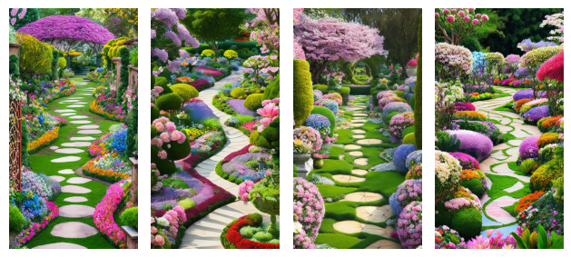

# 🧠 Text-to-Image Generation with Hugging Face Diffusion Models  
Leverage the power of Hugging Face’s cutting-edge **diffusion models** — including **Stable Diffusion** — to transform text prompts into stunning, high-quality images.  

This notebook guides you step-by-step through installing essential libraries, using pre-trained models, and customizing parameters to generate truly unique visual content with ease.

## 🚀 What You’ll Learn

- ✅ How to install and configure Hugging Face tools for diffusion modeling  
- 🧩 Explore and use powerful pre-trained models like Stable Diffusion  
- 🎨 Customize inference parameters for creative control over image outputs  
- 🔄 Insights into hybrid AI architectures for enhanced performance  
- 🌐 Navigate and leverage Hugging Face’s vast **Model Hub**  
- 🔀 Understand multimodal models and their real-world applications  

## 💡 Why This Project?

AI-generated imagery is revolutionizing creative workflows. This project not only demonstrates how to build high-impact generative tools but also explains **how they work**. Whether you're an ML enthusiast, researcher, or developer — this notebook equips you with **practical knowledge and hands-on experience**.

## 📸 Example Outputs

> *"Generate an image that encapsulates the essence of tunisia. Showcase the intricate architecture of historic cities such as gafsa and tozeur, highlighting the region’s cultural richness. Set the image against the backdrop of the arid beauty of the tunisian Desert
 "*  


> *"dreamlike ,picturesque garden adorned with diverse, vibrant flowers in full bloom. Capture the scene’s serenity, featuring meticulously arranged flower beds and meandering pathways. The scene should exude tranquility: A combination of meticulously arranged flower beds and meandering pathways "*  


## 🛠 Tech Stack

- Python  
- Hugging Face Transformers & Diffusers  
- Stable Diffusion  
- PyTorch / CUDA (for GPU acceleration)  
- Jupyter Notebook  

## 📂 How to Run

```bash
# Clone the repo
git clone https://github.com/TLILIFIRAS/AI-Text-to-Image-Generation-with-HuggingFace-Stable-Diffusion-and-Difffusers-models.git  
cd AI-Text-to-Image-Generation-with-HuggingFace-Stable-Diffusion-and-Difffusers-models

# Set up environment
pip install -r requirements.txt

# Run the notebook
jupyter notebook text_to_image_generation.ipynb
```

## 🤝 Contributions & Feedback

Got an idea to improve this project or a prompt you’d like to test? Open an issue or a pull request — I’d love to hear from you!
